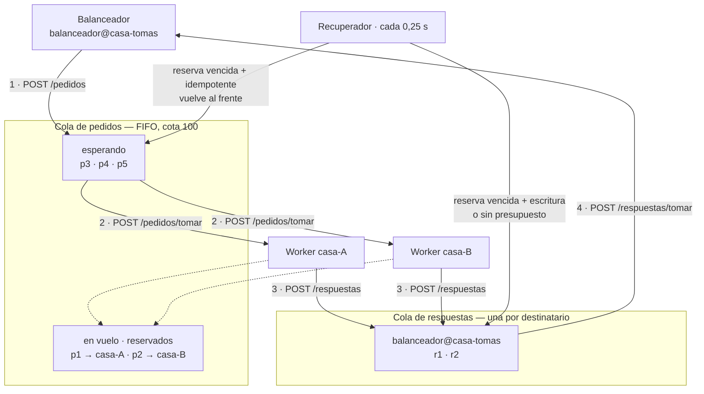

# El sistema de colas

Un proceso aparte del balanceador, con **dos colas**:

| | Quién publica | Quién consume |
| :--- | :--- | :--- |
| **pedidos** | el balanceador | los workers de las réplicas, compitiendo |
| **respuestas** | los workers | el balanceador que originó cada pedido |

Sólo biblioteca estándar. No es ascetismo: el componente que ahora está en el camino crítico
de **cada** request del servicio no agrega ninguna dependencia que pueda romperse ni ninguna
superficie que haya que parchear. La imagen no corre `pip install`.

```bash
python3 cola/servidor.py
COLA_PUERTO=8085 COLA_BIND=100.101.15.93 COLA_TOKEN=... python3 cola/servidor.py
```

---

## Por qué dos colas y no una

Son dos flujos con dueños distintos. En `pedidos` hay N consumidores **compitiendo por el
mismo elemento**: el primero que llega se lo lleva y nadie más lo ve. En `respuestas` cada
elemento tiene **un** destinatario y nadie más lo puede tomar. Con una sola cola, cada
consumidor tendría que filtrar lo que no es suyo y devolver el resto — que es exactamente el
protocolo de reasignación que este diseño evita.

La cola de respuestas está indexada por destinatario por la misma razón: en la Etapa 3 hay dos
balanceadores contra la misma cola, y uno no puede llevarse la respuesta que el otro está
esperando. Con una FIFO sola, el segundo se comería las del primero y los dos clientes
esperarían de más.



## La reserva: lo único que hace que esto sea una cola y no una lista

Un pedido que un worker toma **no se borra**: queda "en vuelo" con un vencimiento
(`COLA_RESERVA`, 2 s). Si el worker no contesta antes, el pedido vuelve al frente y otro lo
toma.

Es lo que reemplaza al `devolver_al_frente()` que antes hacía el worker cuando el gRPC le
fallaba. Con los workers adentro del balanceador, el que se comía el error devolvía el pedido;
ahora el worker está en la réplica y **una réplica que se murió no devuelve nada**. La única
que puede notarlo es la cola, y sólo por el vencimiento.

La regla de qué se reintenta es contrato:

| Qué pasó | `idempotente: true` | `idempotente: false` |
| :--- | :--- | :--- |
| Venció la reserva y queda presupuesto | vuelve al frente | **respuesta `DEADLINE_EXCEEDED`** |
| Venció la reserva y no queda presupuesto | `DEADLINE_EXCEEDED` | `DEADLINE_EXCEEDED` |
| Venció esperando turno, sin que nadie lo tome | `DEADLINE_EXCEEDED` | `DEADLINE_EXCEEDED` |

"No contestó" no dice si el pedido alcanzó a ejecutarse. Repetir un `POST /personas` puede
crear la persona dos veces: preferimos un `504` honesto a un duplicado silencioso. El default
de `idempotente` es **`false`** — ante la duda, no se reintenta.

**Gana la primera respuesta.** Si una réplica lenta contesta después de que la reserva venció
y otra ya resolvió el pedido, la segunda se rechaza con `409 {"resultado": "desconocido"}`.

---

## El contrato HTTP

Todo es `POST` con JSON y respuesta JSON. Todo pide `X-Cola-Token`, menos `GET /health`.

`tomar` es POST y no GET a propósito: saca el elemento de la cola, o sea que cambia el estado
del servidor. Un GET que muta es lo que cualquier reintento automático de un cliente HTTP
convierte en pedidos perdidos.

### Lo que usa el balanceador

<table>
<tr><th><code>POST /pedidos</code></th><th>publicar un pedido</th></tr>
</table>

```jsonc
// →
{"id": "4b7baf0d2d4a4e909ec90c6f17690125",   // uuid4 hex; si falta, lo genera la cola
 "operacion": "POST /personas",              // obligatorio
 "parametros": {"nombre": "Ada", "legajo": 1234},
 "idempotente": false,                       // default false: el seguro
 "destinatario": "balanceador@casa-tomas",   // obligatorio
 "cliente": "100.118.61.111",                // IP del que hizo la request; informativo
 "presupuestoMs": 5000}                      // techo COLA_PRESUPUESTO_MAXIMO

// ← 202 {"id": "4b7baf0d…", "encolado": true}
// ← 503 {"error": "cola llena", "esperando": 100, "cota": 100}
```

<table>
<tr><th><code>POST /respuestas/tomar</code></th><th>recolectar (long-poll)</th></tr>
</table>

```jsonc
// →  {"destinatario": "balanceador@casa-tomas", "espera": 20}
// ← 200 (ver el formato de la respuesta más abajo)
// ← 204 sin cuerpo: no había nada en esos segundos
```

### Lo que usa el worker de la réplica

<table>
<tr><th><code>POST /pedidos/tomar</code></th><th>llevarse el próximo (long-poll)</th></tr>
</table>

```jsonc
// →  {"consumidor": "100.91.134.43:8080", "espera": 20}

// ← 200
{"id": "4b7baf0d2d4a4e909ec90c6f17690125",
 "operacion": "POST /personas",
 "parametros": {"nombre": "Ada", "legajo": 1234},
 "idempotente": false,
 "cliente": "100.118.61.111",
 "quedaMs": 4870,       // presupuesto que le queda: usalo como timeout
 "intento": 1}          // 2 o más = a este pedido ya lo abandonó otra réplica

// ← 204 sin cuerpo: no había trabajo en esos segundos. Volvé a llamar.
```

**`consumidor` tiene que ser el `host:puerto` gRPC de la réplica** — el mismo string que el
balanceador usa como `destino` en su registro. No es capricho: es lo que permite que
`/health` del balanceador cruce "esta réplica está sana" con "esta réplica consumió 40
pedidos y tiene 2 en vuelo" sin traducir nada. Con otro string, la réplica figura como sana y
sin consumir.

**No viaja ningún instante absoluto.** Los relojes de cuatro casas no están sincronizados: si
el pedido llevara un `vence_en`, una máquina adelantada dos segundos descartaría pedidos
vivos. Va `quedaMs`, calculado con el reloj de la cola, que es el único que cuenta.

<table>
<tr><th><code>POST /respuestas</code></th><th>contestar</th></tr>
</table>

```jsonc
// →
{"id": "4b7baf0d2d4a4e909ec90c6f17690125",   // el mismo del pedido
 "estado": "OK",                             // nombre de código de estado gRPC
 "contenido": {"servidoPor": "python-1", "persona": {"id": 7, "nombre": "Ada", "legajo": 1234}},
 "atendidoPor": "100.91.134.43:8080",        // el mismo string que `consumidor`
 "app": "python"}

// ← 202 {"resultado": "entregada"}
// ← 409 {"resultado": "desconocido"}          ese pedido ya lo contestó otro: tirala
// ← 409 {"resultado": "destinatario-saturado"} el balanceador no está recolectando
```

**No mandes `destinatario`: lo pone la cola** con lo que guardó del pedido. El worker no tiene
por qué saber quién le pidió, y si se lo preguntáramos podría contestar apuntando a otro
balanceador y meterle una respuesta ajena.

<table>
<tr><th><code>POST /pedidos/devolver</code></th><th>soltarlo sin atenderlo</th></tr>
</table>

```jsonc
// →  {"id": "4b7baf0d…", "consumidor": "100.91.134.43:8080"}
// ← 200 {"resultado": "devuelto"}
// ← 409 {"resultado": "no-estaba-en-vuelo"}   la reserva ya venció; no hagas nada
```

Para el drenado de un blue/green: la réplica que se apaga devuelve lo que tenía en la mano en
vez de hacer esperar los 2 s de la reserva. Es una optimización, no una garantía — si no llega
a devolverlo, el recuperador lo hace igual, sólo que más tarde.

### La respuesta, como la ve el balanceador

Lo que sale de `POST /respuestas/tomar`. La cola le agrega al JSON del worker lo que sabe del
pedido:

```jsonc
{"id": "4b7baf0d2d4a4e909ec90c6f17690125",
 "operacion": "POST /personas",
 "estado": "OK",
 "contenido": {"servidoPor": "python-1", "persona": {"id": 7, "nombre": "Ada", "legajo": 1234}},
 "atendidoPor": "100.91.134.43:8080",
 "app": "python",
 "intentos": ["100.101.15.93:8090", "100.91.134.43:8080"],  // ← lo agrega la cola
 "esperaMs": 6}                                              // ← lo agrega la cola
```

`intentos` con más de un elemento es la evidencia de la reasignación, y es lo que el
balanceador escribe como `intentos=a→b` en su bitácora.

### Observación

```
GET /health    sin token. Lo consulta el HEALTHCHECK del contenedor.
               → 200 {"cola": "sana", "esperando": 3, "enVuelo": 2, "cota": 100, ...}

GET /estado    con token. Dice qué réplicas consumen y cuánto tienen en vuelo.
               → 200 {"pedidos": {...}, "respuestas": {...}, "consumidores": {...}}
```

`/health` contesta 200 mientras el proceso atienda, sin mirar si hay workers consumiendo: una
cola sin consumidores está sana y llenándose, que es información distinta y sale en `/estado`.

---

## Las operaciones

Esto es lo que tiene que saber hacer el worker. `operacion` es el mismo string que el
balanceador escribe en su bitácora, y cada una mapea 1:1 con un RPC de `contrato.proto`.

| `operacion` | `parametros` | RPC | `contenido` de la respuesta |
| :--- | :--- | :--- | :--- |
| `GET /` | `{}` | `Identidad` | `{app, lenguaje, equipo: [{nombre, apellido, legajo}], version, mensaje, host, arrancado, servidoPor}` |
| `POST /echo` | `{ping}` | `Echo` | `{pong, servidoPor, version}` |
| `GET /personas` | `{}` | `ListarPersonas` | `{servidoPor, personas: [{id, nombre, legajo}]}` |
| `POST /personas` | `{nombre, legajo}` | `CrearPersona` | `{servidoPor, persona: {id, nombre, legajo}}` |

`legajo` llega **siempre como entero**: el balanceador lo normaliza antes de encolar, porque
desde `curl` viene como string.

Cuando el RPC falla, `contenido` es `{"error": "<el detalle>"}` y `estado` es el nombre del
código gRPC que se recibió (`INVALID_ARGUMENT`, `ALREADY_EXISTS`, `NOT_FOUND`, …). El
balanceador lo traduce a HTTP con una tabla; no hace falta que el worker piense en códigos
HTTP.

**El `contenido` lo arma el worker, no el balanceador.** Antes el balanceador traducía el
protobuf campo por campo; ahora lo manda ya armado y el balanceador sólo lo mete en el sobre
del contrato. Agregar un campo a la app dejó de obligar a tocar el balanceador.

## El worker, en veinte líneas

```python
while True:
    codigo, pedido = post("/pedidos/tomar", {"consumidor": MI_DESTINO, "espera": 20})
    if codigo == 204:
        continue                       # no había trabajo; el long-poll ya esperó

    timeout = pedido["quedaMs"] / 1000
    try:
        contenido = RESOLVER[pedido["operacion"]](pedido["parametros"], timeout)
        estado = "OK"
    except grpc.RpcError as e:
        estado, contenido = e.code().name, {"error": e.details()}

    post("/respuestas", {"id": pedido["id"], "estado": estado, "contenido": contenido,
                         "atendidoPor": MI_DESTINO, "app": "python"})
```

Tres cosas que no son obvias y se pagan caras:

1. **Usar `quedaMs` como timeout.** Un worker que ignora el presupuesto sigue trabajando en
   un pedido que la cola ya reasignó: dos réplicas haciendo el mismo trabajo y, en un alta,
   dos personas.
2. **Devolver lo que se tiene en la mano al apagarse** (`SIGTERM` → `POST /pedidos/devolver`).
   Sin eso, cada blue/green le cuesta 2 s de espera a un puñado de pedidos.
3. **Tratar el `409` como normal.** Llega cuando la réplica tardó más que la reserva. No es un
   error del worker y no hay que reintentar: el pedido ya lo contestó otro.

## Variables

| | Default | |
| :--- | :--- | :--- |
| `COLA_PUERTO` | `8085` | |
| `COLA_BIND` | `127.0.0.1` | En el contenedor va `0.0.0.0`: atarse a loopback lo dejaría inalcanzable hasta para su host |
| `COLA_TOKEN` | *(vacío)* | Vacío = **sin autenticación**. Sólo para probar en loopback |
| `COLA_CASA` | `casa-tomas` | Sale en la bitácora |
| `COLA_COTA_PEDIDOS` | `100` | Pasado eso, `503` al balanceador en el acto |
| `COLA_COTA_RESPUESTAS` | `1000` | Por destinatario. Alto a propósito: rechazar una respuesta deja a un cliente colgado |
| `COLA_RESERVA` | `2` | Segundos que tiene un worker para contestar. Bastante menor que el presupuesto |
| `COLA_TTL_RESPUESTAS` | `60` | Cuánto sobrevive una respuesta que nadie recolectó |
| `COLA_ESPERA_MAXIMA` | `30` | Techo del long-poll |
| `COLA_PRESUPUESTO_MAXIMO` | `60` | Techo de `presupuestoMs` |
| `COLA_INTERVALO_RECUPERADOR` | `0.25` | Cada cuánto corre el recuperador |
| `COLA_LOGS` | `logs` | Directorio de la bitácora |

## Seguridad

**El token no es opcional en la demo.** La cola escucha en el tailnet porque los workers están
en otras casas. Sin token, cualquiera que la alcance puede publicar pedidos falsos o —peor—
**tomarlos**, y quedarse con tráfico real de usuarios: nombres y legajos de personas.

Las tres barreras, y hacen falta las tres:

1. `ufw`: sólo entra por `tailscale0`.
2. `COLA_TOKEN` en `X-Cola-Token`, el mismo en el balanceador y en cada worker.
3. El contenedor corre con un usuario sin privilegios (uid 1000), sin el socket de Docker y
   sin `--privileged`.

**Pendiente:** un token para el balanceador y otro para los workers. Publicar un pedido y
consumirlo no son el mismo permiso, y hoy un worker comprometido puede inyectar pedidos.

## Pruebas

```bash
./.venv/bin/python -m unittest discover -s ../tests -p "test_colas.py" -v
./.venv/bin/python -m unittest discover -s ../tests -p "test_servidor_cola.py" -v
```

`test_colas.py` prueba la estructura sin HTTP; `test_servidor_cola.py` levanta el servidor en
un puerto libre y lo habla con `ClienteCola`, que es el cliente real del balanceador — así una
prueba verde quiere decir que los dos extremos hablan el mismo idioma, no que cada uno habla
consigo mismo.

## Lo que no hace, y no por olvido

- **No persiste.** El contrato con el cliente es sincrónico: cuando se volvería a replicar el
  pedido, el cliente ya se fue. Reiniciar el contenedor tira lo que estaba esperando.
- **No reparte.** No hay round-robin ni pesos: el worker libre toma el próximo. El reparto
  sale solo de la velocidad de cada réplica.
- **No sabe qué es una réplica.** Un consumidor es un string. Puede ser Python, Java o `curl`.
- **No valida el contenido de los pedidos.** `operacion` y `parametros` son opacos para la
  cola: quien los entiende es el worker. Cambiar una operación no obliga a tocar este repo.
